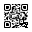
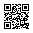
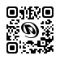

# qrcode

`@sidny/qrcode` is an isomorphic QR code library with a zero-dependency encoding core and an SVG-first rendering pipeline.

## Examples

| Example                   | Preview                                                                                           | What it shows                                                     | Config                                                                                                                                                                                         |
| ------------------------- | ------------------------------------------------------------------------------------------------- | ----------------------------------------------------------------- | ---------------------------------------------------------------------------------------------------------------------------------------------------------------------------------------------- |
| Default rounded           |                  | Rounded connected blobs with a standard quiet zone                | <code>{ format: "svg", margin: 4 }</code>                                                                                                                                                      |
| Default square            |                            | Square fallback rendering with the same quiet zone                | <code>{ format: "svg", rounded: false, margin: 4 }</code>                                                                                                                                      |
| Brand colors              |                        | Custom foreground and background, higher ECL, standard quiet zone | <code>{ format: "svg", foreground: "#6281FF", background: "#E7F9FF", errorCorrection: "Q", margin: 4 }</code>                                                                                  |
| Logo                      |  | Large centered logo cutout with rounded QR rendering              | <code>{ format: "svg", errorCorrection: "H", foreground: "#000", background: "#fff", margin: 4, logo: { source: "./img/logo.svg", width: 11, height: 11, padding: 1 } }</code>                 |


It is built around a few specific goals:

- a clean modern API
- a zero-dependency core for QR encoding and SVG output
- smooth rounded connected-blob rendering
- true centered logo cutouts in module space
- configurable error correction
- configurable foreground and background colors
- optional raster export for `png` and `webp`

## Highlights

- `svg`, `png`, and `webp` output
- browser + Bun/Node support
- zero-dependency `encode()` and `toSvg()` sync escape hatches
- logo source normalization:
  file path on the server, URL or data URL in the browser
- module-based logo sizing:
  `width` and `height` are specified in QR modules, not pixels
- true logo cutout:
  modules are removed before rendering instead of painting a logo over the top
- optional raster output:
  `sharp` on Bun/Node, `OffscreenCanvas.convertToBlob()` in browsers

## Install

Core SVG usage does not need any runtime dependency beyond `@sidny/qrcode`.

```bash
bun add @sidny/qrcode
```

Optional raster support on Bun/Node:

```bash
bun add sharp
```

## Quick Start

```ts
import { qrcode } from "@sidny/qrcode";

const svg = await qrcode("https://plarza.com", {
  format: "svg",
  foreground: "#111827",
  background: "#f8fafc",
  errorCorrection: "H",
  logo: {
    source: "/absolute/path/to/logo.png",
    width: 9,
    height: 9,
    padding: 1,
  },
});
```

## Public API

```ts
export type ErrorCorrection = "L" | "M" | "Q" | "H";

export type LogoSpec = {
  source?: string;
  width: number;
  height: number;
  padding?: number;
};

export type QrCodeOptions = {
  errorCorrection?: ErrorCorrection;
  foreground?: string;
  background?: string;
  rounded?: boolean;
  logo?: LogoSpec;
  scale?: number;
  margin?: number;
};

export function qrcode(data: string, opts: QrCodeOptions & { format: "svg" }): Promise<string>;
export function qrcode(data: string, opts: QrCodeOptions & { format: "png" }): Promise<Uint8Array>;
export function qrcode(data: string, opts: QrCodeOptions & { format: "webp" }): Promise<Uint8Array>;
export function getAlignedRasterSize(svg: string, minimumSize: number): number;
export function rasterizeSvg(svg: string, size: number, format: "png" | "webp"): Promise<Uint8Array>;

export function encode(data: string, ecl?: ErrorCorrection): QrMatrix;
export function toSvg(matrix: QrMatrix, opts?: Omit<QrCodeOptions, "scale">): string;
```

## API Notes

### `qrcode(data, opts)`

High-level async API.

- Generates the QR matrix
- Normalizes logo input into a data URL
- Returns SVG directly or rasterizes it to `png` / `webp`

Defaults:

- `errorCorrection`: `"M"`
- `foreground`: `"#000"`
- `background`: `"#fff"`
- `rounded`: `true`
- `scale`: `8`
- `margin`: `0`

### `encode(data, ecl?)`

Low-level synchronous encoder.

- zero dependency
- no logo I/O
- returns the QR matrix for custom rendering

Current scope:

- UTF-8 byte-mode payloads

### `toSvg(matrix, opts?)`

Low-level synchronous SVG renderer.

- zero dependency
- accepts a pre-encoded matrix
- supports colors, quiet zone, rounded mode, and logo cutout

Important:

- if you pass a logo with `source` to `toSvg()`, `logo.source` must already be a data URL
- use `qrcode()` when you want file paths or remote URLs normalized automatically
- omit `logo.source` when you only want the logo cutout and will draw your own centered artwork

## Runtime Behavior

### SVG

SVG is always available and stays zero dependency.

### Raster Output

`png` and `webp` are produced from the generated SVG:

- Bun/Node:
  optional dynamic import of `sharp`
- Browser:
  `OffscreenCanvas` + `createImageBitmap()` + `convertToBlob()`

If the required raster backend is unavailable, `qrcode()` throws a helpful runtime error.

## Logo Behavior

Logo sizing is defined in modules:

```ts
logo: {
  source: "./img/logo.svg",
  width: 9,
  height: 9,
  padding: 1,
}
```

That is intentional. Module-based sizing is the only scale-independent way to describe a QR cutout cleanly.

Notes:

- `width` and `height` must be positive integers
- `padding` is additional cutout space in modules
- the logo is centered automatically
- the cutout removes dark modules before rendering
- for logo-heavy designs, `errorCorrection: "H"` is strongly recommended

## Usage Patterns

### Server-side SVG

```ts
import { qrcode } from "@sidny/qrcode";

const svg = await qrcode("https://plarza.com", {
  format: "svg",
  foreground: "#111827",
  background: "#ffffff",
});
```

### Server-side raster output

```ts
import { qrcode } from "@sidny/qrcode";

const png = await qrcode("https://plarza.com", {
  format: "png",
  scale: 12,
  errorCorrection: "Q",
});
```

### Browser logo URL

```ts
import { qrcode } from "@sidny/qrcode";

const svg = await qrcode("https://plarza.com", {
  format: "svg",
  errorCorrection: "H",
  logo: {
    source: "/logo-mark.svg",
    width: 8,
    height: 8,
    padding: 1,
  },
});
```

### Zero-dependency sync path

```ts
import { encode, toSvg } from "@sidny/qrcode";

const matrix = encode("hello world", "M");
const svg = toSvg(matrix, {
  foreground: "#000",
  background: "#fff",
  rounded: true,
});
```

### Sync path with a pre-normalized logo

```ts
import { encode, toSvg } from "@sidny/qrcode";

const matrix = encode("hello world", "H");
const svg = toSvg(matrix, {
  logo: {
    source: "data:image/svg+xml;base64,...",
    width: 8,
    height: 8,
    padding: 1,
  },
});
```
